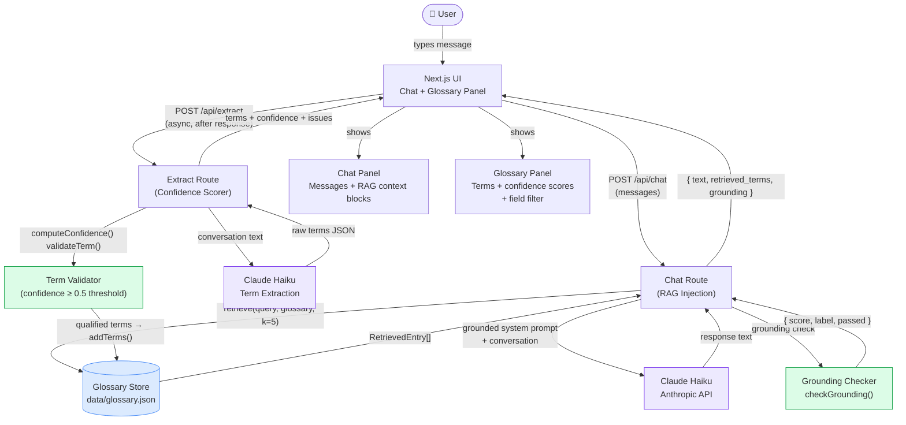

# Lemma — System Architecture

## Mermaid Diagram

## Data Flow Description

### Chat with RAG (user sends message)
1. User message arrives at `POST /api/chat`
2. `retrieve()` scores all glossary entries against the query using token overlap
3. Top-k entries injected into Claude's system prompt as grounding context
4. Claude generates a response that draws on the glossary
5. `checkGrounding()` measures what fraction of retrieved terms appear in the response
6. Response returned with `retrieved_terms[]` and `grounding` object
7. UI renders the message bubble + retrieved context block + grounding badge

### Term Extraction (async after response)
1. Full conversation sent to `POST /api/extract`
2. Claude extracts domain-specific terms as JSON
3. `computeConfidence()` scores each term (0–1) based on field presence, definition quality, quote presence
4. `validateTerm()` flags specific issues per term
5. Terms with confidence ≥ 0.5 are persisted to `data/glossary.json`
6. All terms (including low-confidence ones) returned to UI with issues flagged

### Glossary Store (persistence layer)
- JSON file at `data/glossary.json`, read/written by `src/lib/glossary-store.ts`
- Deduplication: terms already in store are not re-added
- Available via `GET /api/glossary` (count + all terms)
- Clearable via `DELETE /api/glossary`

## Component Map

| Component | File | Role |
|-----------|------|------|
| UI | `src/app/page.tsx` | Chat interface + glossary panel |
| Chat Route | `src/app/api/chat/route.ts` | RAG injection + grounding |
| Extract Route | `src/app/api/extract/route.ts` | Term extraction + confidence |
| Export Route | `src/app/api/export/route.ts` | JSON/Markdown export |
| Glossary Route | `src/app/api/glossary/route.ts` | Persistent store CRUD |
| Check Route | `src/app/api/check/route.ts` | Batch term validation |
| Glossary Store | `src/lib/glossary-store.ts` | File I/O for glossary |
| Retriever | `src/lib/retriever.ts` | Token-overlap RAG retrieval |
| Grounding | `src/lib/grounding.ts` | Confidence scoring + guardrails |
